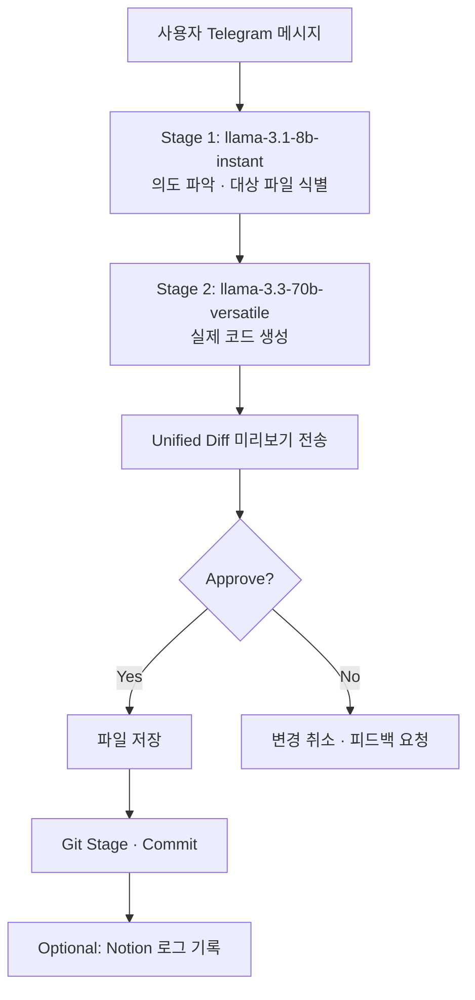

# telegram-agent

텔레그램 채팅으로 로컬 코드를 자연어 명령으로 수정하는 AI 코딩 에이전트

## 주요 기능

- 자연어 명령 한 줄로 파일 생성·수정·삭제 — IDE 없이 Telegram에서 코드 변경
- **2단계 LLM 파이프라인**: 경량 모델(의도 파악 · 파일 식별) → 고성능 모델(코드 생성)으로 비용 최적화
- diff 미리보기 후 approve / reject 승인 워크플로
- 승인 즉시 Git 자동 커밋 · push
- `/analyze` 명령으로 AI 코드 품질 리뷰 (critical / warning / suggestion 분류)
- `.env`, `.key`, `.pem`, SSH 키 등 민감 파일 접근 차단
- Notion 커밋 로그 연동 (선택 사항)
- 프로젝트 다중 관리 (`/switch`) 및 최근 5개 수정 이력 추적

## 기술 스택


## 아키텍처



## 실행 방법

```bash
# 의존성 설치
cd telegram-coding-agent
npm install

# 환경 변수 설정
cp .env.example .env
# .env 필수 항목 입력:
# TELEGRAM_BOT_TOKEN  - BotFather에서 발급
# ALLOWED_USER_ID     - 허용할 Telegram 사용자 ID
# GROQ_API_KEY        - Groq API 키
# TARGET_PROJECT_PATH - 수정할 프로젝트 절대 경로

# 개발 모드 (nodemon hot-reload)
npm run dev

# 프로덕션 (PM2 자동 재시작)
pm2 start ecosystem.config.js
```

## 주요 Telegram 명령어

| 명령어 | 설명 |
|--------|------|
| 일반 텍스트 | 자연어 코드 수정 요청 |
| `/analyze [파일경로]` | AI 코드 품질 리뷰 |
| `/show [파일경로]` | 파일 내용 조회 (최대 50줄) |
| `/history` | 최근 5개 수정 이력 확인 |
| `/undo` | 마지막 Git 커밋 되돌리기 |
| `/npm <command>` | npm 명령 실행 (화이트리스트 기반) |
| `/projects` | 등록된 프로젝트 목록 |
| `/switch <name>` | 활성 프로젝트 변경 |
| `/status` | 잠금 상태 · 마지막 작업 확인 |
| `/cancel` | 대기 중인 모든 상태 초기화 |

## 스크린샷

<!-- TODO: Telegram 채팅 화면 — 코드 수정 명령 입력 스크린샷 -->
<!-- TODO: diff 미리보기 메시지 스크린샷 -->
<!-- TODO: approve 후 Git 커밋 결과 스크린샷 -->
